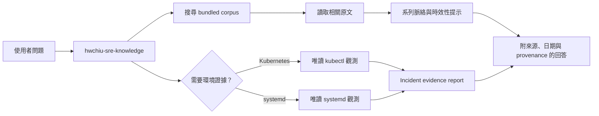

# pi-hwchiu

把 hwchiu（邱宏瑋 / HungWei Chiu）的 SRE、DevOps、Kubernetes、網路與雲端文章帶進 [Pi](https://pi.dev)。

`pi-hwchiu` 讓 Pi 先搜尋並閱讀原文，再根據來源回答技術問題。

搜尋支援中英混合 lexical ranking、文章類型、tag、年份與 match mode 篩選，並回傳命中段落與排名理由。

套件也提供系列閱讀、文章 provenance、時效性風險提示，以及有明確範圍、逾時與輸出上限的唯讀 Kubernetes 與 systemd 觀測工具。

## 特色

- 收錄 catalog 所列的完整文章 snapshot，而非只有摘要或向量片段。
- 支援繁體中文與 English technical terms 的 BM25 lexical search。
- 支援文章類型、tag、年份與 any/all match mode 篩選。
- 顯示 bounded match excerpt、命中欄位與命中詞。
- 提供 curated 系列的上一篇、下一篇與相關閱讀。
- 回答時要求標示文章標題、日期、bundled path 與 revision-pinned original URL。
- 區分 hwchiu 的技術文章與整理外部內容的閱讀筆記。
- 對版本、API、價格、安全建議與供應商行為提供可解釋的 current-verification signal。
- Kubernetes 與 systemd 工具只執行固定的唯讀觀測命令。
- 所有工具都有參數驗證與輸出上限，外部觀測命令另有逾時限制。

## 內容

| 元件 | 數量 | 用途 |
| --- | ---: | --- |
| Agent Skill | 1 | 定義搜尋、閱讀、引用、診斷與變更核准流程 |
| Knowledge catalog | 1 | 記錄目前 snapshot counts、digests 與上游 revision |
| Curated series catalog | 1 | 記錄系列名稱與文章順序 |
| Custom tools | 6 | 搜尋、閱讀、相關文章、Kubernetes、systemd 與 incident report |
| Prompt template | 1 | 從目前 session 建立 incident evidence report |

## 系統需求

- Pi
- Node.js 22 或更新版本
- `kubectl`，僅在使用 Kubernetes 觀測工具時需要
- `systemctl` 與 `journalctl`，僅在 Linux 上使用 systemd 觀測工具時需要

## 安裝

Pi package 會以目前使用者的權限執行。

安裝第三方 package 前，請先檢查其 skill 與 extension 原始碼。

從 npm 安裝：

```sh
pi install npm:pi-hwchiu
```

從 GitHub 安裝：

```sh
pi install git:github.com/narumiruna/pi-hwchiu
```

不安裝、只在本次執行暫時載入：

```sh
pi -e npm:pi-hwchiu
```

## 使用方式

安裝後直接向 Pi 提問即可。

例如：

```text
根據 hwchiu 的文章解釋 Kubernetes Service，並列出來源。
```

```text
整理邱宏瑋對 GitOps 優缺點的看法，區分原創文章與閱讀筆記。
```

```text
找出與 Kubernetes OOM 事件有關的文章，再提供一份排查順序。
```

```text
先確認我的 Kubernetes context，再觀察 staging namespace 的 Warning events 與 Pod health。
```

```text
讀取 staging namespace 中 api Pod 最近一小時的 previous container logs。
```

```text
/hwchiu-incident-report staging payments API CrashLoop
```

符合 SRE、DevOps、Kubernetes、容器、Linux 網路、GitOps、CI/CD、雲端、儲存、安全或可觀測性任務時，Pi 會按需載入 `hwchiu-sre-knowledge` skill。

也可以明確要求載入：

```text
/skill:hwchiu-sre-knowledge 解釋 CNI 與 Kubernetes Service 的責任邊界
```

## 運作方式



Skill 會先搜尋索引，再讀取每一篇準備引用的文章。

診斷任務會區分 observation、hypothesis、test 與 conclusion，不會把讀取環境資訊視為變更授權。

## Tools

| Tool | 功能 | 主要限制 |
| --- | --- | --- |
| `hwchiu_knowledge_search` | 以 BM25 搜尋標題、tag、路徑、摘要與全文 | 唯讀；支援 kind、tag、年份與 match mode；每次最多 20 筆 |
| `hwchiu_read_article` | 依 catalog 路徑讀取文章指定行數 | 唯讀；只接受已收錄文章；每次最多要求 1,000 行 |
| `hwchiu_related_articles` | 讀取系列順序與 deterministic related results | 唯讀；只接受已收錄文章；每次最多 20 筆 related results |
| `hwchiu_k8s_observe` | 讀取 context、resources、events、pod-health、describe 與 logs | 固定 `kubectl` 參數；不讀取 Secret；不支援 mutation |
| `hwchiu_systemd_observe` | 讀取 failed units、unit status 與 journal | 不使用 `sudo`；不重啟或修改 unit |
| `hwchiu_incident_report` | 將已收集證據格式化成 Markdown report | 不執行 command；不寫檔；bounded structured input |

Search 2.0 是離線 lexical search，使用 field-weighted BM25、English tokens、CJK bigrams 與有限 alias expansion。

它不會推論未出現的語意同義詞，因此跨術語查詢仍應嘗試中英文 technical terms。

文章讀取與外部觀測結果最多回傳 50KB 或 2,000 行，以先到者為準。

Kubernetes logs 每次最多讀取 500 行，並可限制為最近 86,400 秒或 previous container instance。

Events 可使用固定 selector 只顯示 Warning。

`pod-health` 使用固定 columns 顯示 phase、readiness、restart、node、resource requests 與 limits，不讀取完整 Pod spec。

systemd journal 每次最多讀取 500 行。

Kubernetes 觀測支援以下 resource kinds：

```text
pods, deployments, statefulsets, daemonsets, jobs, services, nodes
```

## 安全邊界

觀測工具使用固定的 command 與 allowlist 參數，不接受任意 shell command。

Kubernetes 操作只支援 context、resources、events、pod-health、describe 與 logs。

systemd 操作只支援 failed-units、status 與 logs。

所有外部命令都有短時間逾時，並在回傳前截斷輸出。

Cluster events、application logs、resource descriptions 與 journal 仍可能包含敏感資料。

使用觀測工具前，應先確認 Kubernetes context、namespace、unit 與資料範圍。

任何 restart、configuration change 或 cluster mutation 都不在這些 tools 的能力範圍內。

Incident report 只整理目前 session 內的 bounded evidence，不會自動執行觀測、修改環境或寫入 repository。

## Knowledge Corpus

文章來源為 [hwchiu/docusaurus-blog](https://github.com/hwchiu/docusaurus-blog)。

完整索引位於 [`skills/hwchiu-sre-knowledge/references/INDEX.md`](skills/hwchiu-sre-knowledge/references/INDEX.md)。

主題入口位於 [`skills/hwchiu-sre-knowledge/references/TOPICS.md`](skills/hwchiu-sre-knowledge/references/TOPICS.md)。

系列文章入口位於 [`skills/hwchiu-sre-knowledge/references/SERIES.md`](skills/hwchiu-sre-knowledge/references/SERIES.md)。

文章 catalog 位於 [`skills/hwchiu-sre-knowledge/references/catalog.json`](skills/hwchiu-sre-knowledge/references/catalog.json)。

系列 catalog 位於 [`skills/hwchiu-sre-knowledge/references/series.json`](skills/hwchiu-sre-knowledge/references/series.json)。

Catalog 記錄上游 Git revision、revision date、每篇文章的 SHA-256 digest 與 revision-pinned source URL。

Freshness signal 是 risk signal，而不是文章正確性的 verdict。

例如舊的 Kubernetes API 或 cloud provider 操作文章會要求 current verification，但不會自動被宣告為錯誤。

歷史文章是經驗與觀點來源，不應自動視為目前產品文件。

使用版本、指令、API、價格、供應商行為或安全建議前，仍應對照目標環境與最新官方文件。

## 本機開發

Clone repository 並安裝依賴：

```sh
git clone https://github.com/narumiruna/pi-hwchiu.git
cd pi-hwchiu
npm install
```

執行完整檢查：

```sh
npm run ci
```

在 repository 根目錄啟動 Pi：

```sh
pi
```

專案的 [`.pi/settings.json`](.pi/settings.json) 會把 repository 根目錄當作 local package 載入。

第一次開啟時需要信任此專案。

也可以從其他目錄暫時載入 checkout：

```sh
pi -e /path/to/pi-hwchiu
```

## 同步文章

預設從 repository 內的 `docusaurus-blog/` checkout 重新產生文章、catalog 與索引：

```sh
npm run sync:blog
```

也可以傳入其他本機 checkout：

```sh
npm run sync:blog -- /path/to/docusaurus-blog
```

檢查目前 bundled snapshot 是否與 source checkout 一致且不修改檔案：

```sh
npm run sync:check
```

同步器會列出 added、removed 與 modified paths。

同步後執行：

```sh
npm run ci
```

Weekly GitHub Actions workflow 只偵測 upstream drift，不會自動發佈 package 或建立 release。

## 發佈前檢查

確認 npm tarball 內容：

```sh
npm pack --dry-run
```

`prepack` 會自動執行完整 CI。

## License 與來源

本專案使用 [`AGPL-3.0-only`](LICENSE)。

收錄文章來自 hwchiu（邱宏瑋 / HungWei Chiu）的公開 repository，並保留來源標示。
